# The Art of Unit Testing - Second Edition

> 作者：Roy Osherove
> 書籍網站：http://ArtOfUnitTesting.com | http://manning.com/osherove2

本專案包含《The Art of Unit Testing》第二版的範例程式碼，並提供兩個現代化版本：

| 版本 | 目錄 | 框架 | 說明 |
|------|------|------|------|
| 原始版本 | `ArtOfUnitTesting2ndEd.Samples/` | .NET Framework 4.0 | 書籍原始範例（請勿修改） |
| .NET Framework 版本 | `ArtOfUnitTesting.NetFramework/` | .NET Framework 4.8 | 升級至最新 .NET Framework |
| .NET Core 版本 | `ArtOfUnitTesting.NetCore/` | .NET 8.0 | 升級至最新 .NET |

---

## 目錄

1. [快速開始](#快速開始)
2. [什麼是單元測試](#什麼是單元測試)
3. [單元測試的三大支柱](#單元測試的三大支柱)
4. [Arrange-Act-Assert 模式](#arrange-act-assert-模式)
5. [Chapter 1：單元測試基礎](#chapter-1單元測試基礎)
6. [Chapter 2-4：LogAnalyzer 核心測試](#chapter-2-4loganalyzer-核心測試)
7. [Chapter 5：Stub 與 Mock 的差異](#chapter-5stub-與-mock-的差異)
8. [Chapter 6：測試階層架構](#chapter-6測試階層架構)
9. [Chapter 7：時間依賴處理](#chapter-7時間依賴處理)
10. [依賴注入與可測試性](#依賴注入與可測試性)
11. [隔離框架 vs 手寫假物件](#隔離框架-vs-手寫假物件)
12. [整體架構總覽](#整體架構總覽)
13. [.NET Framework vs .NET Core 差異](#net-framework-vs-net-core-差異)
14. [測試命名慣例](#測試命名慣例)
15. [專案結構](#專案結構)
16. [執行測試](#執行測試)

---

## 快速開始

### .NET Framework 4.8 版本

```bash
cd ArtOfUnitTesting.NetFramework
dotnet restore
dotnet build
dotnet test
```

### .NET 8 版本

```bash
cd ArtOfUnitTesting.NetCore
dotnet restore
dotnet build
dotnet test
```

---

## 什麼是單元測試

根據書中定義：

> **單元測試**是一段自動化的程式碼，用於呼叫被測試的工作單元 (Unit of Work)，然後驗證該單元的某個最終結果。單元測試幾乎總是使用單元測試框架撰寫，可以輕鬆地被編寫並快速執行。它是可信賴、可讀且可維護的。只要生產程式碼沒有變動，測試結果就應該是一致的。

### 工作單元 (Unit of Work)

**工作單元**可以是：
- 單一方法
- 多個方法組成的邏輯
- 多個類別協作完成的功能

### 最終結果的三種類型

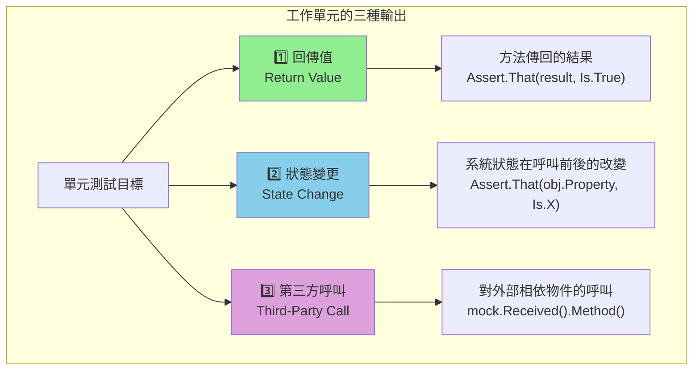
```mermaid
graph TB
    subgraph "工作單元的三種輸出"
        A[單元測試目標] --> B["1️⃣ 回傳值<br/>Return Value"]
        A --> C["2️⃣ 狀態變更<br/>State Change"]
        A --> D["3️⃣ 第三方呼叫<br/>Third-Party Call"]

        B --> B1["方法傳回的結果<br/>Assert.That(result, Is.True)"]
        C --> C1["系統狀態在呼叫前後的改變<br/>Assert.That(obj.Property, Is.X)"]
        D --> D1["對外部相依物件的呼叫<br/>mock.Received().Method()"]
    end

    style B fill:#90EE90
    style C fill:#87CEEB
    style D fill:#DDA0DD
```

### 測試金字塔

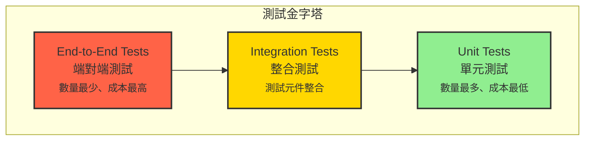
```mermaid
graph TB
    subgraph "測試金字塔"
        E2E["End-to-End Tests<br/>端對端測試<br/><small>數量最少、成本最高</small>"]
        INT["Integration Tests<br/>整合測試<br/><small>測試元件整合</small>"]
        UNIT["Unit Tests<br/>單元測試<br/><small>數量最多、成本最低</small>"]
    end

    E2E --> INT
    INT --> UNIT

    style UNIT fill:#90EE90,stroke:#333,stroke-width:2px
    style INT fill:#FFD700,stroke:#333,stroke-width:2px
    style E2E fill:#FF6347,stroke:#333,stroke-width:2px
```

### 單元測試 vs 整合測試

| 特性 | 單元測試 | 整合測試 |
|------|----------|----------|
| 執行速度 | 極快（毫秒） | 較慢（秒或更久） |
| 依賴項 | 無外部依賴 | 可能依賴資料庫、檔案系統等 |
| 隔離性 | 完全隔離 | 測試多個元件整合 |
| 失敗原因 | 容易定位 | 可能需要排查多個元件 |

---

## 單元測試的三大支柱

良好的單元測試應具備以下特性：

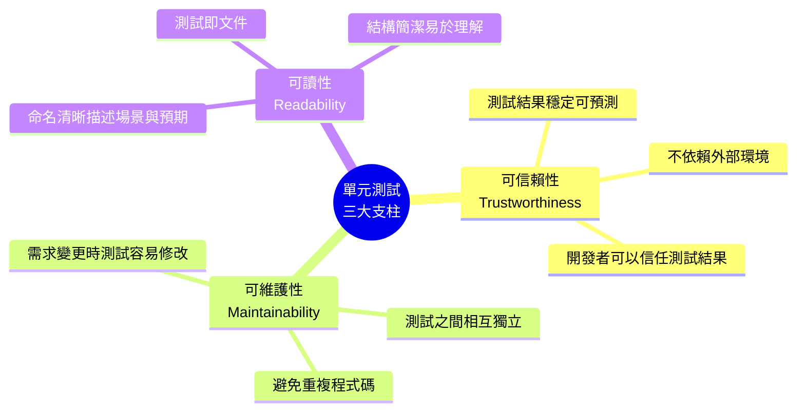
```mermaid
mindmap
  root((單元測試<br/>三大支柱))
    可信賴性<br/>Trustworthiness
      測試結果穩定可預測
      不依賴外部環境
      開發者可以信任測試結果
    可維護性<br/>Maintainability
      需求變更時測試容易修改
      避免重複程式碼
      測試之間相互獨立
    可讀性<br/>Readability
      測試即文件
      命名清晰描述場景與預期
      結構簡潔易於理解
```

### 1. 可信賴性 (Trustworthiness)

- 測試結果穩定、可預測
- 不依賴外部環境（資料庫、網路、檔案系統）
- 開發者可以信任測試結果

### 2. 可維護性 (Maintainability)

- 當需求變更時，測試容易修改
- 避免重複程式碼
- 測試之間相互獨立

### 3. 可讀性 (Readability)

- 測試即文件，說明程式碼的預期行為
- 命名清晰，描述測試場景與預期結果
- 結構簡潔，易於理解

---

## Arrange-Act-Assert 模式

每個單元測試都應遵循 **AAA 模式**：

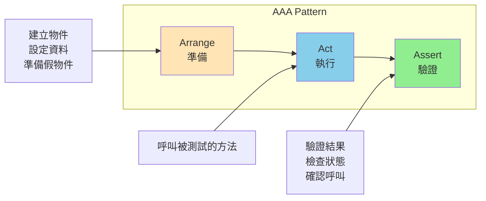
```mermaid
graph LR
    subgraph "AAA Pattern"
        A["Arrange<br/>準備"] --> B["Act<br/>執行"] --> C["Assert<br/>驗證"]
    end

    A1["建立物件<br/>設定資料<br/>準備假物件"] --> A
    B1["呼叫被測試的方法"] --> B
    C1["驗證結果<br/>檢查狀態<br/>確認呼叫"] --> C

    style A fill:#FFE4B5
    style B fill:#87CEEB
    style C fill:#90EE90
```

### 基本範例

```csharp
[Test]
public void IsValidLogFileName_BadExtension_ReturnsFalse()
{
    // Arrange - 準備測試所需的物件和資料
    LogAnalyzer analyzer = new LogAnalyzer();

    // Act - 執行被測試的方法
    bool result = analyzer.IsValidLogFileName("filewithbadextension.foo");

    // Assert - 驗證結果是否符合預期
    Assert.That(result, Is.False);
}
```

### 驗證例外狀況

```csharp
[Test]
public void IsValidLogFileName_EmptyFileName_ThrowsException()
{
    // Arrange
    LogAnalyzer la = new LogAnalyzer();

    // Act & Assert
    var ex = Assert.Throws<ArgumentException>(() =>
        la.IsValidLogFileName(string.Empty));

    Assert.That(ex.Message, Does.Contain("filename has to be provided"));
}
```

### 驗證狀態變更

```csharp
[Test]
public void IsValidLogFileName_WhenCalled_ChangesWasLastFileNameValid()
{
    // Arrange
    LogAnalyzer la = new LogAnalyzer();

    // Act
    la.IsValidLogFileName("badname.foo");

    // Assert
    Assert.That(la.WasLastFileNameValid, Is.False);
}
```

### 參數化測試

使用 `[TestCase]` 屬性可以減少重複的測試程式碼：

```csharp
[TestCase("filewithgoodextension.SLF", true)]
[TestCase("filewithgoodextension.slf", true)]
[TestCase("filewithbadextension.foo", false)]
public void IsValidLogFileName_VariousExtensions_ChecksThem(string file, bool expected)
{
    // Arrange
    LogAnalyzer analyzer = new LogAnalyzer();

    // Act
    bool result = analyzer.IsValidLogFileName(file);

    // Assert
    Assert.That(result, Is.EqualTo(expected));
}
```

---

## Chapter 1：單元測試基礎

展示最基本的解析器與手動測試方式，說明從手動測試演進到自動化測試的過程。

### 類別圖

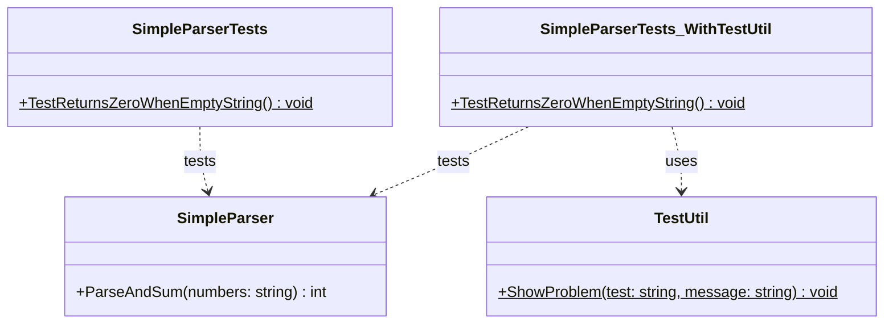
```mermaid
classDiagram
    class SimpleParser {
        +ParseAndSum(numbers: string) int
    }

    class SimpleParserTests {
        +TestReturnsZeroWhenEmptyString()$ void
    }

    class TestUtil {
        +ShowProblem(test: string, message: string)$ void
    }

    class SimpleParserTests_WithTestUtil {
        +TestReturnsZeroWhenEmptyString()$ void
    }

    SimpleParserTests ..> SimpleParser : tests
    SimpleParserTests_WithTestUtil ..> SimpleParser : tests
    SimpleParserTests_WithTestUtil ..> TestUtil : uses
```

### 程式碼範例

**被測試的類別：**

```csharp
public class SimpleParser
{
    public int ParseAndSum(string numbers)
    {
        if (numbers.Length == 0)
            return 0;
        if (!numbers.Contains(","))
            return int.Parse(numbers);
        else
            throw new InvalidOperationException(
                "I can only handle 0 or 1 numbers for now!");
    }
}
```

**手動測試（演進前）：**

```csharp
public class SimpleParserTests
{
    public static void TestReturnsZeroWhenEmptyString()
    {
        try
        {
            SimpleParser p = new SimpleParser();
            int result = p.ParseAndSum(string.Empty);
            if (result != 0)
            {
                Console.WriteLine("Parse and sum should have returned 0");
            }
        }
        catch (Exception e)
        {
            Console.WriteLine(e);
        }
    }
}
```

### 測試執行流程

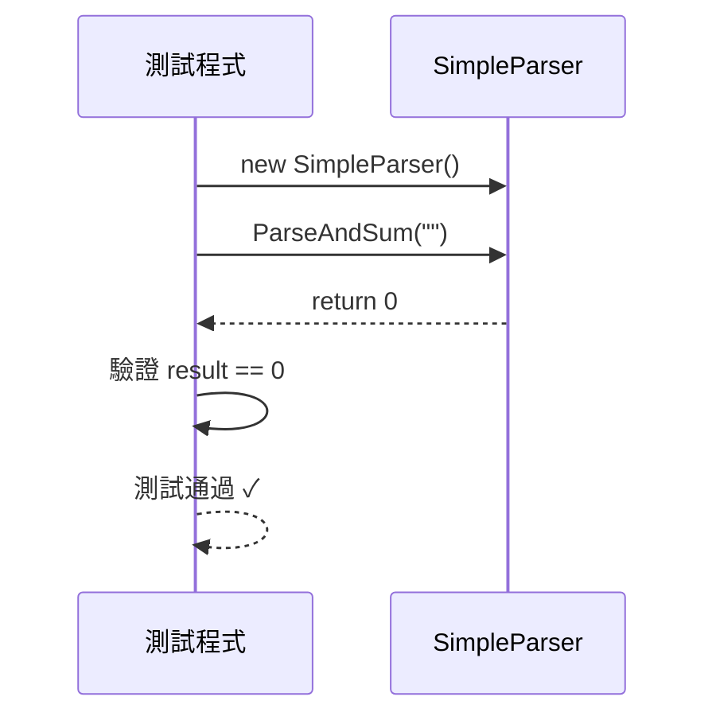
```mermaid
sequenceDiagram
    participant Test as 測試程式
    participant Parser as SimpleParser

    Test->>Parser: new SimpleParser()
    Test->>Parser: ParseAndSum("")
    Parser-->>Test: return 0
    Test->>Test: 驗證 result == 0
    Test-->>Test: 測試通過 ✓
```

---

## Chapter 2-4：LogAnalyzer 核心測試

展示使用 NUnit 框架的正規單元測試，涵蓋三種輸出類型的測試方式。

### 類別圖

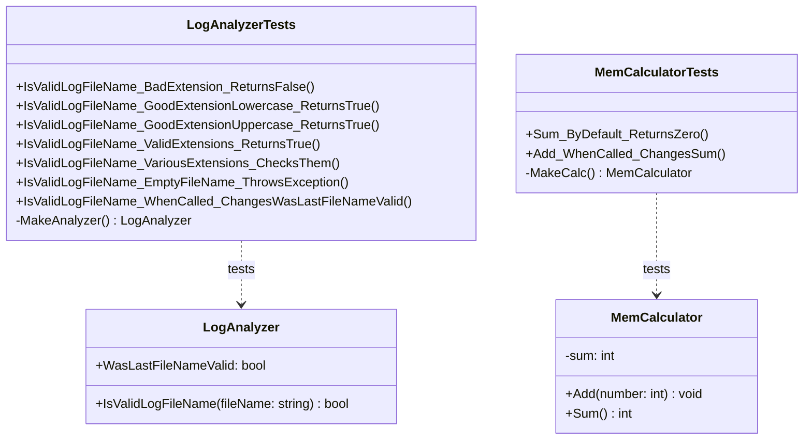
```mermaid
classDiagram
    class LogAnalyzer {
        +WasLastFileNameValid: bool
        +IsValidLogFileName(fileName: string) bool
    }

    class MemCalculator {
        -sum: int
        +Add(number: int) void
        +Sum() int
    }

    class LogAnalyzerTests {
        +IsValidLogFileName_BadExtension_ReturnsFalse()
        +IsValidLogFileName_GoodExtensionLowercase_ReturnsTrue()
        +IsValidLogFileName_GoodExtensionUppercase_ReturnsTrue()
        +IsValidLogFileName_ValidExtensions_ReturnsTrue()
        +IsValidLogFileName_VariousExtensions_ChecksThem()
        +IsValidLogFileName_EmptyFileName_ThrowsException()
        +IsValidLogFileName_WhenCalled_ChangesWasLastFileNameValid()
        -MakeAnalyzer() LogAnalyzer
    }

    class MemCalculatorTests {
        +Sum_ByDefault_ReturnsZero()
        +Add_WhenCalled_ChangesSum()
        -MakeCalc() MemCalculator
    }

    LogAnalyzerTests ..> LogAnalyzer : tests
    MemCalculatorTests ..> MemCalculator : tests
```

### LogAnalyzer 核心邏輯

```csharp
public class LogAnalyzer
{
    public bool WasLastFileNameValid { get; set; }

    public bool IsValidLogFileName(string fileName)
    {
        WasLastFileNameValid = false;

        if (string.IsNullOrEmpty(fileName))
        {
            throw new ArgumentException("filename has to be provided");
        }
        if (!fileName.EndsWith(".SLF", StringComparison.CurrentCultureIgnoreCase))
        {
            return false;
        }

        WasLastFileNameValid = true;
        return true;
    }
}
```

### 三種測試類型示例

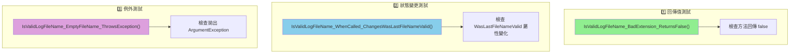
```mermaid
graph TB
    subgraph "1️⃣ 回傳值測試"
        A1["IsValidLogFileName_BadExtension_ReturnsFalse()"]
        A2["檢查方法回傳 false"]
        A1 --> A2
    end

    subgraph "2️⃣ 狀態變更測試"
        B1["IsValidLogFileName_WhenCalled_ChangesWasLastFileNameValid()"]
        B2["檢查 WasLastFileNameValid 屬性變化"]
        B1 --> B2
    end

    subgraph "3️⃣ 例外測試"
        C1["IsValidLogFileName_EmptyFileName_ThrowsException()"]
        C2["檢查拋出 ArgumentException"]
        C1 --> C2
    end

    style A1 fill:#90EE90
    style B1 fill:#87CEEB
    style C1 fill:#DDA0DD
```

---

## Chapter 5：Stub 與 Mock 的差異

這是書中最重要的概念之一。

### 概念比較圖

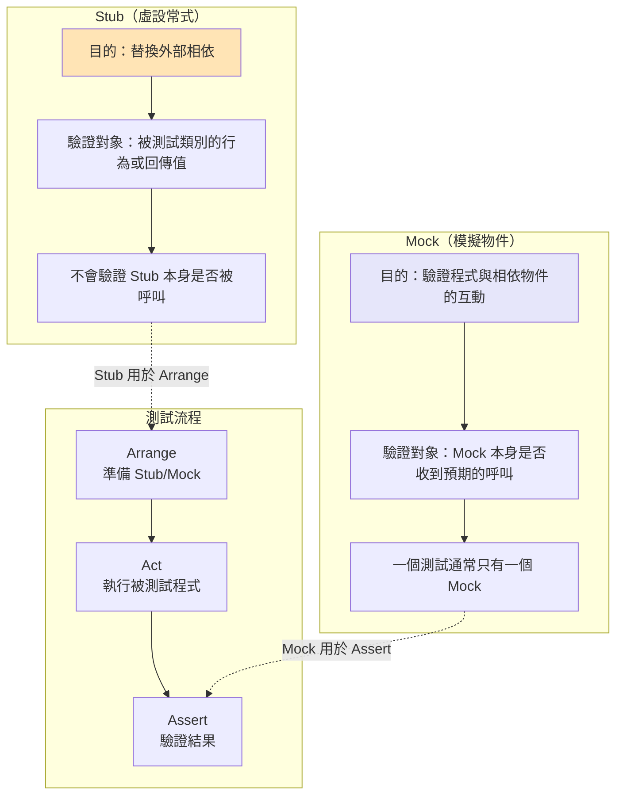
```mermaid
graph TB
    subgraph "Stub（虛設常式）"
        S1["目的：替換外部相依"]
        S2["驗證對象：被測試類別的行為或回傳值"]
        S3["不會驗證 Stub 本身是否被呼叫"]
        S1 --> S2 --> S3
    end

    subgraph "Mock（模擬物件）"
        M1["目的：驗證程式與相依物件的互動"]
        M2["驗證對象：Mock 本身是否收到預期的呼叫"]
        M3["一個測試通常只有一個 Mock"]
        M1 --> M2 --> M3
    end

    subgraph "測試流程"
        T1["Arrange<br/>準備 Stub/Mock"]
        T2["Act<br/>執行被測試程式"]
        T3["Assert<br/>驗證結果"]
        T1 --> T2 --> T3
    end

    S3 -.->|"Stub 用於 Arrange"| T1
    M3 -.->|"Mock 用於 Assert"| T3

    style S1 fill:#FFE4B5
    style M1 fill:#E6E6FA
```

### Stub vs Mock 比較表

| 概念 | 用途 | 驗證方式 |
|------|------|----------|
| **Stub** | 提供間接輸入給被測試程式 | 不驗證 Stub 本身 |
| **Mock** | 驗證程式與相依物件的互動 | 驗證呼叫次數、參數等 |

### 類別圖 - 依賴注入架構

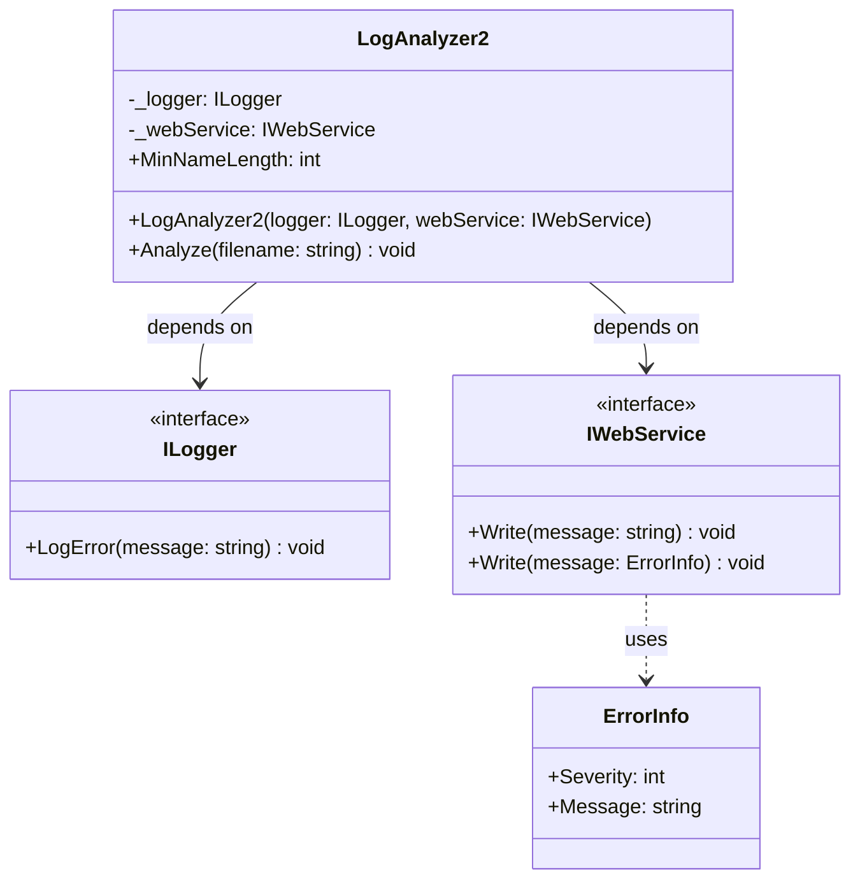
```mermaid
classDiagram
    class ILogger {
        <<interface>>
        +LogError(message: string) void
    }

    class IWebService {
        <<interface>>
        +Write(message: string) void
        +Write(message: ErrorInfo) void
    }

    class LogAnalyzer2 {
        -_logger: ILogger
        -_webService: IWebService
        +MinNameLength: int
        +LogAnalyzer2(logger: ILogger, webService: IWebService)
        +Analyze(filename: string) void
    }

    class ErrorInfo {
        +Severity: int
        +Message: string
    }

    LogAnalyzer2 --> ILogger : depends on
    LogAnalyzer2 --> IWebService : depends on
    IWebService ..> ErrorInfo : uses
```

### 完整範例：同時使用 Stub 與 Mock

**待測程式碼：**

```csharp
public class LogAnalyzer2
{
    private readonly ILogger _logger;
    private readonly IWebService _webService;

    public LogAnalyzer2(ILogger logger, IWebService webService)
    {
        _logger = logger;
        _webService = webService;
    }

    public int MinNameLength { get; set; }

    public void Analyze(string filename)
    {
        if (filename.Length < MinNameLength)
        {
            try
            {
                _logger.LogError($"Filename too short: {filename}");
            }
            catch (Exception e)
            {
                // 當 Logger 發生例外時，呼叫 WebService
                _webService.Write("Error From Logger: " + e);
            }
        }
    }
}
```

**測試程式碼：**

```csharp
[Test]
public void Analyze_LoggerThrows_CallsWebService()
{
    // Arrange
    var mockWebService = Substitute.For<IWebService>();  // 這是 Mock - 稍後要驗證
    var stubLogger = Substitute.For<ILogger>();          // 這是 Stub - 只是提供假行為

    // 設定 Stub 行為：當呼叫 LogError 時拋出例外
    stubLogger.When(logger => logger.LogError(Arg.Any<string>()))
              .Do(info => { throw new Exception("fake exception"); });

    var analyzer = new LogAnalyzer2(stubLogger, mockWebService);
    analyzer.MinNameLength = 10;

    // Act
    analyzer.Analyze("Short.txt");

    // Assert - 驗證 Mock 是否收到預期的呼叫
    mockWebService.Received()
        .Write(Arg.Is<string>(s => s.Contains("fake exception")));
}
```

### 測試執行流程

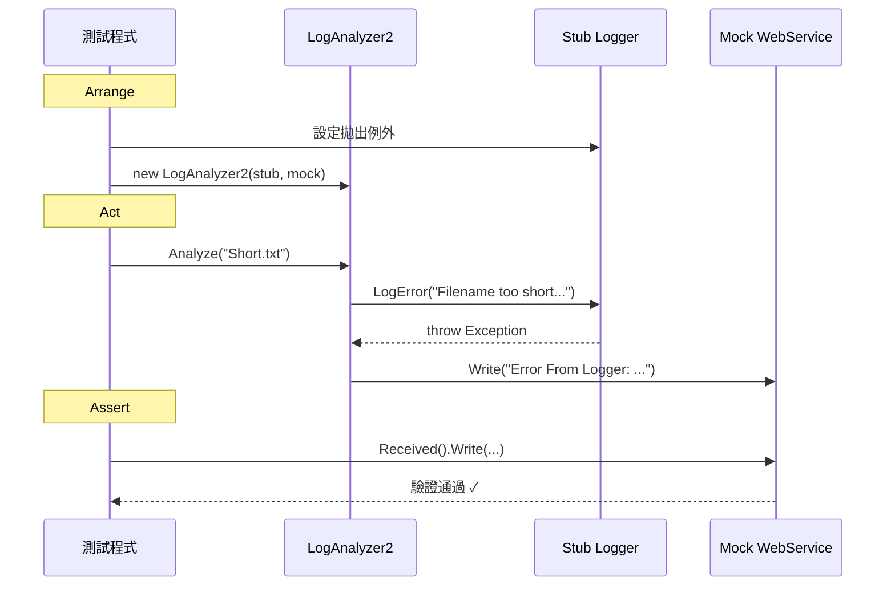
```mermaid
sequenceDiagram
    participant Test as 測試程式
    participant LA as LogAnalyzer2
    participant Stub as Stub Logger
    participant Mock as Mock WebService

    Note over Test: Arrange
    Test->>Stub: 設定拋出例外
    Test->>LA: new LogAnalyzer2(stub, mock)

    Note over Test: Act
    Test->>LA: Analyze("Short.txt")
    LA->>Stub: LogError("Filename too short...")
    Stub-->>LA: throw Exception
    LA->>Mock: Write("Error From Logger: ...")

    Note over Test: Assert
    Test->>Mock: Received().Write(...)
    Mock-->>Test: 驗證通過 ✓
```

---

## 依賴注入與可測試性

為了使程式碼可測試，需要將外部相依注入到類別中。

### 建構子注入 (Constructor Injection)

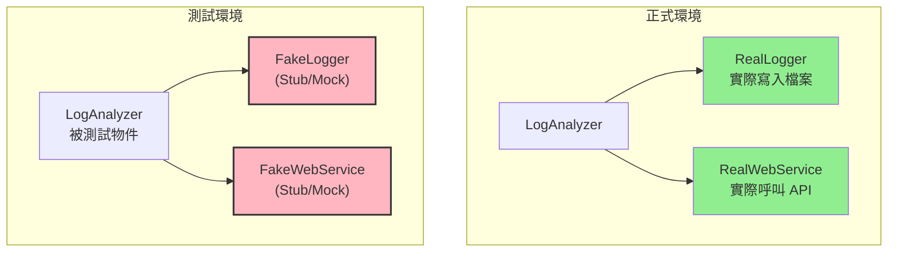
```mermaid
graph TB
    subgraph "正式環境"
        LA1[LogAnalyzer]
        RL[RealLogger<br/>實際寫入檔案]
        RW[RealWebService<br/>實際呼叫 API]
        LA1 --> RL
        LA1 --> RW
    end

    subgraph "測試環境"
        LA2[LogAnalyzer<br/>被測試物件]
        FL["FakeLogger<br/>(Stub/Mock)"]
        FW["FakeWebService<br/>(Stub/Mock)"]
        LA2 --> FL
        LA2 --> FW
    end

    style FL fill:#FFB6C1,stroke:#333,stroke-width:2px
    style FW fill:#FFB6C1,stroke:#333,stroke-width:2px
    style RL fill:#90EE90
    style RW fill:#90EE90
```

**程式碼範例：**

```csharp
public class LogAnalyzer
{
    private readonly ILogger _logger;

    // 透過建構子注入相依物件
    public LogAnalyzer(ILogger logger)
    {
        _logger = logger;
    }

    public int MinNameLength { get; set; }

    public void Analyze(string filename)
    {
        if (filename.Length < MinNameLength)
        {
            _logger.LogError($"Filename too short: {filename}");
        }
    }
}
```

這種設計讓我們可以在測試時注入假物件（Stub 或 Mock）。

---

## 隔離框架 vs 手寫假物件

### 手寫假物件

```csharp
public class FakeLogger : ILogger
{
    public Exception WillThrow = null;
    public string LoggerGotMessage = null;

    public void LogError(string message)
    {
        LoggerGotMessage = message;
        if (WillThrow != null)
        {
            throw WillThrow;
        }
    }
}
```

**使用手寫假物件的測試：**

```csharp
[Test]
public void Analyze_LoggerThrows_CallsWebService_WithHandwritten()
{
    // Arrange
    var stubLogger = new FakeLogger();
    stubLogger.WillThrow = new Exception("fake exception");

    var mockWebService = new FakeWebService();

    var analyzer = new LogAnalyzer2(stubLogger, mockWebService);
    analyzer.MinNameLength = 10;

    // Act
    analyzer.Analyze("Short.txt");

    // Assert
    Assert.That(mockWebService.LastMessage, Does.Contain("fake exception"));
}
```

### 使用 NSubstitute 隔離框架

```csharp
[Test]
public void Analyze_LoggerThrows_CallsWebService_WithNSubstitute()
{
    // Arrange
    var stubLogger = Substitute.For<ILogger>();
    stubLogger.When(logger => logger.LogError(Arg.Any<string>()))
              .Do(info => { throw new Exception("fake exception"); });

    var mockWebService = Substitute.For<IWebService>();

    var analyzer = new LogAnalyzer2(stubLogger, mockWebService);
    analyzer.MinNameLength = 10;

    // Act
    analyzer.Analyze("Short.txt");

    // Assert
    mockWebService.Received()
        .Write(Arg.Is<string>(s => s.Contains("fake exception")));
}
```

### 比較圖

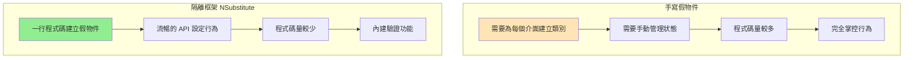
```mermaid
graph TB
    subgraph "手寫假物件"
        H1["需要為每個介面建立類別"]
        H2["需要手動管理狀態"]
        H3["程式碼量較多"]
        H4["完全掌控行為"]
        H1 --> H2 --> H3 --> H4
    end

    subgraph "隔離框架 NSubstitute"
        N1["一行程式碼建立假物件"]
        N2["流暢的 API 設定行為"]
        N3["程式碼量較少"]
        N4["內建驗證功能"]
        N1 --> N2 --> N3 --> N4
    end

    style H1 fill:#FFE4B5
    style N1 fill:#90EE90
```

### NSubstitute 常用語法

```csharp
// 建立假物件
IFileNameRules fakeRules = Substitute.For<IFileNameRules>();

// 設定回傳值
fakeRules.IsValidLogFileName(Arg.Any<string>()).Returns(true);

// 設定拋出例外
fakeRules.When(x => x.IsValidLogFileName(Arg.Any<string>()))
         .Do(_ => throw new Exception("fake exception"));

// 驗證是否被呼叫
mockWebService.Received().Write(Arg.Any<string>());

// 驗證呼叫次數
mockWebService.Received(1).Write(Arg.Any<string>());

// 驗證未被呼叫
mockWebService.DidNotReceive().Write(Arg.Any<string>());
```

---

## Chapter 6：測試階層架構

展示使用抽象類別和繼承來組織解析器的模式。

### 類別圖 - 字串解析器繼承架構

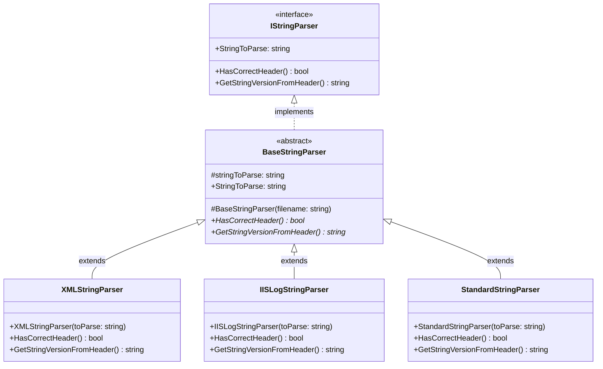
```mermaid
classDiagram
    class IStringParser {
        <<interface>>
        +StringToParse: string
        +HasCorrectHeader() bool
        +GetStringVersionFromHeader() string
    }

    class BaseStringParser {
        <<abstract>>
        #stringToParse: string
        +StringToParse: string
        #BaseStringParser(filename: string)
        +HasCorrectHeader()* bool
        +GetStringVersionFromHeader()* string
    }

    class XMLStringParser {
        +XMLStringParser(toParse: string)
        +HasCorrectHeader() bool
        +GetStringVersionFromHeader() string
    }

    class IISLogStringParser {
        +IISLogStringParser(toParse: string)
        +HasCorrectHeader() bool
        +GetStringVersionFromHeader() string
    }

    class StandardStringParser {
        +StandardStringParser(toParse: string)
        +HasCorrectHeader() bool
        +GetStringVersionFromHeader() string
    }

    IStringParser <|.. BaseStringParser : implements
    BaseStringParser <|-- XMLStringParser : extends
    BaseStringParser <|-- IISLogStringParser : extends
    BaseStringParser <|-- StandardStringParser : extends
```

### 繼承架構圖

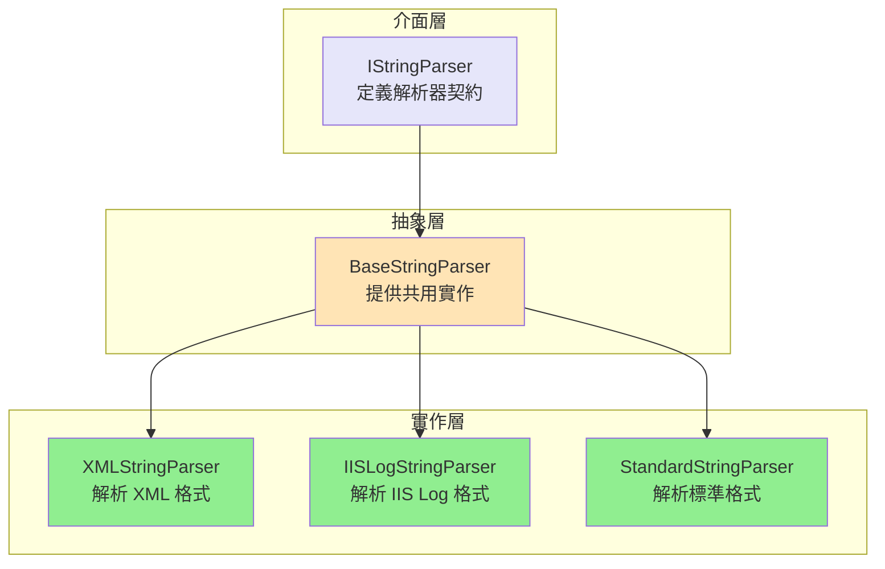
```mermaid
graph TB
    subgraph "介面層"
        ISP[IStringParser<br/>定義解析器契約]
    end

    subgraph "抽象層"
        BSP[BaseStringParser<br/>提供共用實作]
    end

    subgraph "實作層"
        XSP[XMLStringParser<br/>解析 XML 格式]
        IISP[IISLogStringParser<br/>解析 IIS Log 格式]
        SSP[StandardStringParser<br/>解析標準格式]
    end

    ISP --> BSP
    BSP --> XSP
    BSP --> IISP
    BSP --> SSP

    style ISP fill:#E6E6FA
    style BSP fill:#FFE4B5
    style XSP fill:#90EE90
    style IISP fill:#90EE90
    style SSP fill:#90EE90
```

### 程式碼範例

```csharp
public interface IStringParser
{
    string StringToParse { get; }
    bool HasCorrectHeader();
    string GetStringVersionFromHeader();
}

public abstract class BaseStringParser : IStringParser
{
    public string StringToParse { get; }

    protected BaseStringParser(string filename)
    {
        StringToParse = filename;
    }

    public abstract bool HasCorrectHeader();
    public abstract string GetStringVersionFromHeader();
}

public class XMLStringParser : BaseStringParser
{
    public XMLStringParser(string toParse) : base(toParse) { }

    public override bool HasCorrectHeader()
    {
        // XML 解析邏輯
        return false;
    }

    public override string GetStringVersionFromHeader()
    {
        // XML 版本解析邏輯
        return string.Empty;
    }
}
```

---

## Chapter 7：時間依賴處理

展示如何處理與時間相關的測試，透過可替換的 SystemTime 類別來控制時間。

### 類別圖

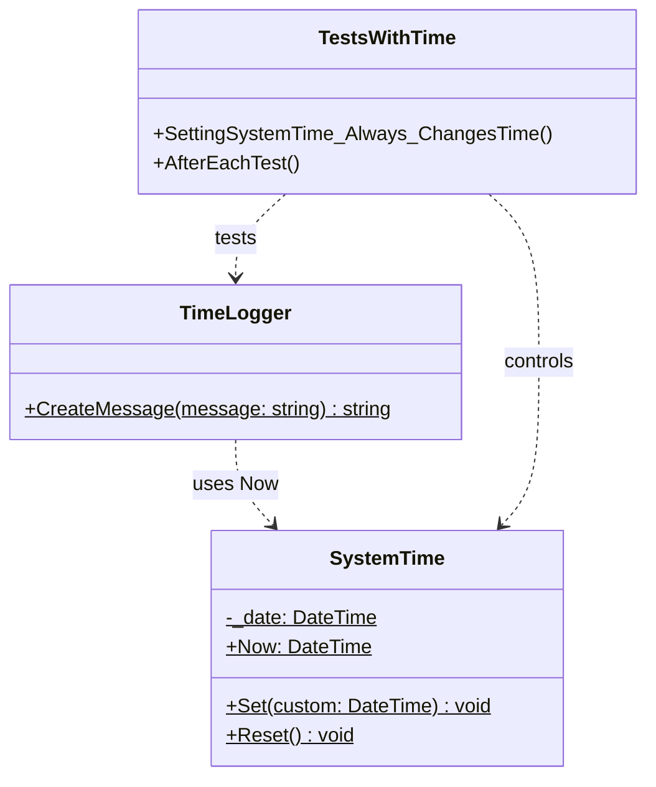
```mermaid
classDiagram
    class SystemTime {
        -_date: DateTime$
        +Set(custom: DateTime)$ void
        +Reset()$ void
        +Now: DateTime$
    }

    class TimeLogger {
        +CreateMessage(message: string)$ string
    }

    class TestsWithTime {
        +SettingSystemTime_Always_ChangesTime()
        +AfterEachTest()
    }

    TimeLogger ..> SystemTime : uses Now
    TestsWithTime ..> SystemTime : controls
    TestsWithTime ..> TimeLogger : tests
```

### 時間控制流程

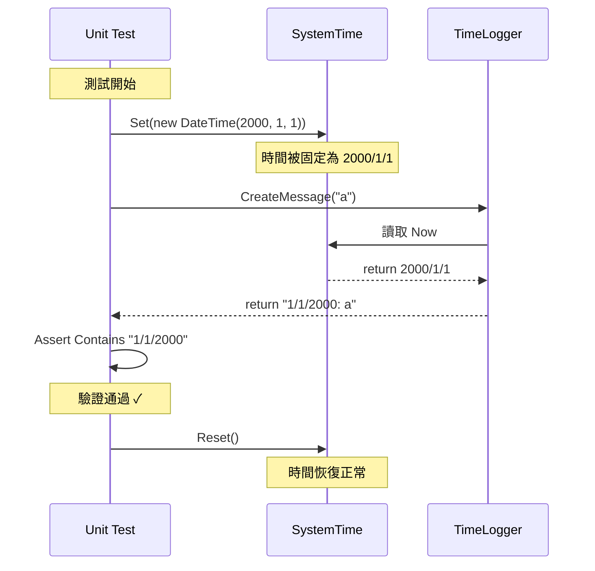
```mermaid
sequenceDiagram
    participant Test as Unit Test
    participant ST as SystemTime
    participant TL as TimeLogger

    Note over Test: 測試開始
    Test->>ST: Set(new DateTime(2000, 1, 1))
    Note over ST: 時間被固定為 2000/1/1

    Test->>TL: CreateMessage("a")
    TL->>ST: 讀取 Now
    ST-->>TL: return 2000/1/1
    TL-->>Test: return "1/1/2000: a"

    Test->>Test: Assert Contains "1/1/2000"
    Note over Test: 驗證通過 ✓

    Test->>ST: Reset()
    Note over ST: 時間恢復正常
```

### 程式碼範例

**SystemTime 工具類別：**

```csharp
public static class SystemTime
{
    private static DateTime _date;

    public static void Set(DateTime custom)
    {
        _date = custom;
    }

    public static void Reset()
    {
        _date = DateTime.MinValue;
    }

    public static DateTime Now => _date != DateTime.MinValue ? _date : DateTime.Now;
}

public static class TimeLogger
{
    public static string CreateMessage(string message) => $"{SystemTime.Now}: {message}";
}
```

**測試程式：**

```csharp
[TestFixture]
public class TestsWithTime
{
    [Test]
    public void SettingSystemTime_Always_ChangesTime()
    {
        SystemTime.Set(new DateTime(2000, 1, 1));

        string output = TimeLogger.CreateMessage("a");

        Assert.That(output, Does.Contain("1/1/2000"));
    }

    [TearDown]
    public void AfterEachTest()
    {
        SystemTime.Reset();  // 確保每次測試後重置
    }
}
```

---

## 整體架構總覽

### 專案模組關係圖

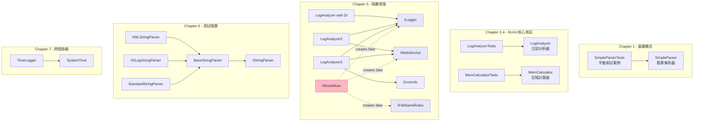
```mermaid
graph TB
    subgraph "Chapter 1 - 基礎概念"
        SP[SimpleParser<br/>簡單解析器]
        SPT[SimpleParserTests<br/>手動測試範例]
        SPT --> SP
    end

    subgraph "Chapter 2-4 - NUnit 核心測試"
        LA1[LogAnalyzer<br/>日誌分析器]
        MC[MemCalculator<br/>記憶計算器]
        LAT1[LogAnalyzerTests]
        MCT[MemCalculatorTests]
        LAT1 --> LA1
        MCT --> MC
    end

    subgraph "Chapter 5 - 隔離框架"
        IL[ILogger]
        IW[IWebService]
        IFR[IFileNameRules]
        LA2[LogAnalyzer with DI]
        LA3[LogAnalyzer2]
        LA4[LogAnalyzer3]
        EI[ErrorInfo]
        NSub[NSubstitute]

        LA2 --> IL
        LA3 --> IL
        LA3 --> IW
        LA4 --> IL
        LA4 --> IW
        LA4 --> EI
        NSub -.->|creates fake| IL
        NSub -.->|creates fake| IW
        NSub -.->|creates fake| IFR
    end

    subgraph "Chapter 6 - 測試階層"
        ISP[IStringParser]
        BSP[BaseStringParser]
        XSP[XMLStringParser]
        IISP[IISLogStringParser]
        SSP[StandardStringParser]

        BSP --> ISP
        XSP --> BSP
        IISP --> BSP
        SSP --> BSP
    end

    subgraph "Chapter 7 - 時間依賴"
        ST[SystemTime]
        TL[TimeLogger]
        TL --> ST
    end

    style NSub fill:#FFB6C1
    style IL fill:#E6E6FA
    style IW fill:#E6E6FA
    style IFR fill:#E6E6FA
```

### 測試類型分佈

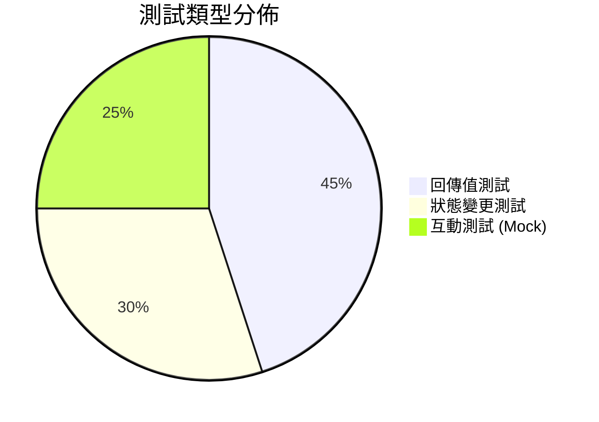
```mermaid
pie title 測試類型分佈
    "回傳值測試" : 45
    "狀態變更測試" : 30
    "互動測試 (Mock)" : 25
```

---

## .NET Framework vs .NET Core 差異

### 1. 專案設定差異

| 項目 | .NET Framework 4.8 | .NET 8.0 |
|------|-------------------|----------|
| 目標框架 | `net48` | `net8.0` |
| Implicit Usings | 否（需明確 using） | `enable`（自動引入常用命名空間） |
| Nullable | 否 | `enable`（啟用 nullable 參考型別） |
| 語言版本 | C# 7.3（預設） | C# 12（預設） |

### 2. 語法差異對照

#### 命名空間宣告

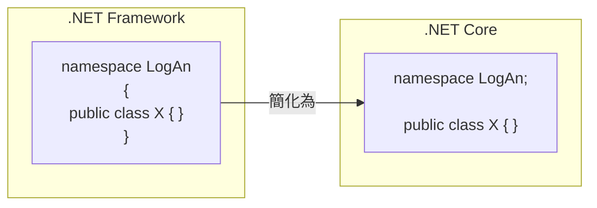
```mermaid
graph LR
    subgraph ".NET Framework"
        A1["namespace LogAn<br/>{<br/>    public class X { }<br/>}"]
    end

    subgraph ".NET Core"
        A2["namespace LogAn;<br/><br/>public class X { }"]
    end

    A1 -->|"簡化為"| A2
```

**.NET Framework:**
```csharp
using System;

namespace LogAn
{
    public class LogAnalyzer
    {
        // 類別內容
    }
}
```

**.NET Core:**
```csharp
namespace LogAn;

public class LogAnalyzer
{
    // 類別內容（不需要額外縮排）
}
```

#### 物件初始化

| .NET Framework | .NET Core |
|----------------|-----------|
| `new LogAnalyzer()` | `new()` |
| `new SimpleParser()` | `new()` |
| `new MemCalculator()` | `new()` |

```csharp
// .NET Framework
LogAnalyzer analyzer = new LogAnalyzer();

// .NET Core（目標型別推斷）
LogAnalyzer analyzer = new();
```

#### 字串處理

**.NET Framework:**
```csharp
_logger.LogError(string.Format("Filename too short: {0}", filename));

string msg = string.Format(@"
---{0}---
       {1}
--------------------
", test, message);
```

**.NET Core:**
```csharp
_logger.LogError($"Filename too short: {filename}");

string msg = $"""

---{test}---
       {message}
--------------------

""";  // Raw String Literals (C# 11+)
```

#### Nullable 參考型別

**.NET Framework:**
```csharp
public override bool Equals(object obj)
{
    if (ReferenceEquals(null, obj)) return false;
    // ...
}
```

**.NET Core:**
```csharp
public bool Equals(ErrorInfo? other)  // 明確標示可為 null
{
    if (other is null) return false;  // 使用 pattern matching
    return Severity == other.Severity && Message == other.Message;
}

public override bool Equals(object? obj) => Equals(obj as ErrorInfo);
```

#### GetHashCode 實作

**.NET Framework:**
```csharp
public override int GetHashCode()
{
    unchecked
    {
        return (_severity * 397) ^ (_message?.GetHashCode() ?? 0);
    }
}
```

**.NET Core:**
```csharp
public override int GetHashCode() => HashCode.Combine(Severity, Message);
```

#### Lambda 表達式

**.NET Framework:**
```csharp
fakeRules.When(x => x.IsValidLogFileName(Arg.Any<string>()))
         .Do(x => { throw new Exception("fake exception"); });

private static MemCalculator MakeCalc()
{
    return new MemCalculator();
}
```

**.NET Core:**
```csharp
fakeRules.When(x => x.IsValidLogFileName(Arg.Any<string>()))
         .Do(_ => throw new Exception("fake exception"));  // 使用棄元 _

private static MemCalculator MakeCalc() => new();  // 表達式主體
```

### 3. 語法演進圖

```mermaid
graph TB
    subgraph "C# 語法演進"
        direction TB
        F1["傳統命名空間區塊<br/>namespace X { }"] --> C1["檔案範圍命名空間<br/>namespace X;"]
        F2["明確 new Type()"] --> C2["目標型別 new()"]
        F3["string.Format()"] --> C3["字串插值 $&quot;&quot;<br/>Raw String &quot;&quot;&quot;&quot;&quot;&quot;"]
        F4["手動 null 檢查"] --> C4["Nullable 參考型別<br/>Type?"]
        F5["手動 GetHashCode"] --> C5["HashCode.Combine()"]
        F6["完整 Lambda 語法"] --> C6["簡化 Lambda<br/>棄元 _ 運算子"]
        F7["多行 getter"] --> C7["表達式主體成員<br/>=&gt;"]
    end

    subgraph ".NET Framework 4.8"
        F1
        F2
        F3
        F4
        F5
        F6
        F7
    end

    subgraph ".NET 8.0"
        C1
        C2
        C3
        C4
        C5
        C6
        C7
    end

    style F1 fill:#FFE4B5
    style F2 fill:#FFE4B5
    style F3 fill:#FFE4B5
    style F4 fill:#FFE4B5
    style F5 fill:#FFE4B5
    style F6 fill:#FFE4B5
    style F7 fill:#FFE4B5
    style C1 fill:#90EE90
    style C2 fill:#90EE90
    style C3 fill:#90EE90
    style C4 fill:#90EE90
    style C5 fill:#90EE90
    style C6 fill:#90EE90
    style C7 fill:#90EE90
```

---

## 測試命名慣例

### 推薦的命名格式

```
[被測試的方法]_[測試情境]_[預期行為]
```

這種命名方式讓測試：
- **自我說明** - 不需閱讀程式碼就能理解測試目的
- **易於維護** - 需求變更時容易找到相關測試
- **成為文件** - 描述系統的預期行為

### 命名範例

```mermaid
graph LR
    subgraph "好的命名 ✓"
        G1["IsValidLogFileName_BadExtension_ReturnsFalse"]
        G2["IsValidLogFileName_EmptyFileName_ThrowsException"]
        G3["Analyze_ShortFileName_CallsLogger"]
        G4["Sum_ByDefault_ReturnsZero"]
        G5["Add_WhenCalled_ChangesSum"]
    end

    subgraph "不好的命名 ✗"
        B1["Test1"]
        B2["TestLogAnalyzer"]
        B3["ItWorks"]
        B4["CheckValidation"]
    end

    style G1 fill:#90EE90
    style G2 fill:#90EE90
    style G3 fill:#90EE90
    style G4 fill:#90EE90
    style G5 fill:#90EE90
    style B1 fill:#FFB6C1
    style B2 fill:#FFB6C1
    style B3 fill:#FFB6C1
    style B4 fill:#FFB6C1
```

---

## 專案結構

```
art-of-unit-test/
├── ArtOfUnitTesting2ndEd.Samples/    # 原始範例（請勿修改）
│
├── ArtOfUnitTesting.NetFramework/    # .NET Framework 4.8 版本
│   ├── Chapter1/                     # 第一章：基礎概念
│   │   └── SimpleParser.cs
│   ├── Chapter1.Console/             # 主控台應用程式
│   │   └── Program.cs
│   ├── LogAn/                        # LogAnalyzer 類別庫
│   │   ├── LogAnalyzer.cs
│   │   └── MemCalculator.cs
│   ├── LogAn.UnitTests/              # LogAnalyzer 單元測試
│   │   ├── LogAnalyzerTests.cs
│   │   └── MemCalculatorTests.cs
│   ├── Chapter5.LogAn/               # 第五章：依賴注入範例
│   │   ├── ILogger.cs
│   │   ├── IFileNameRules.cs
│   │   └── LogAnalyzer.cs            # 含有 ILogger、IWebService 相依
│   ├── NSubExamples/                 # NSubstitute 範例
│   │   └── NSubBasics.cs
│   ├── Examples/                     # 其他範例
│   │   ├── IStringParser.cs
│   │   ├── BaseStringParser.cs
│   │   └── SystemTime.cs
│   ├── Examples.Tests/               # 進階測試範例
│   │   ├── UsingSystemTime.cs
│   │   ├── Inherited/                # 測試繼承模式
│   │   └── TemplateTestClassExample/ # 測試模板模式
│   └── AppendixBDemos/               # 附錄 B：整合測試
│
├── ArtOfUnitTesting.NetCore/         # .NET 8 版本
│   └── (同上結構，使用現代 C# 語法)
│
└── The_Art_of_Unit_Testing_Second_Edition.epub  # 電子書
```

---

## 執行測試

### 使用命令列

```bash
# 還原套件
dotnet restore

# 建置專案
dotnet build

# 執行所有測試
dotnet test

# 執行特定專案的測試
dotnet test LogAn.UnitTests/LogAn.UnitTests.csproj

# 顯示詳細輸出
dotnet test --logger "console;verbosity=detailed"

# 產生程式碼覆蓋率報告 (.NET 8)
dotnet test --collect:"XPlat Code Coverage"

# 執行特定測試
dotnet test --filter "FullyQualifiedName~LogAnalyzerTests"
```

### 使用 Visual Studio

1. 開啟 Test Explorer（測試 → 測試總管）
2. 點擊「執行所有測試」或個別執行

---

## 使用的套件

| 套件 | 版本 | 用途 |
|------|------|------|
| NUnit | 4.2.2 | 單元測試框架 |
| NUnit3TestAdapter | 4.6.0 | Visual Studio 測試適配器 |
| Microsoft.NET.Test.Sdk | 17.11.1 | 測試 SDK |
| NSubstitute | 5.1.0 | 隔離框架（建立 Stub/Mock） |
| Moq | 4.20.72 | 隔離框架（另一選擇） |
| coverlet.collector | 6.0.2 | 程式碼覆蓋率（僅 .NET 8） |

---

## 升級說明

本專案已從原始 .NET Framework 4.0 升級。主要變更包括：

1. **專案格式**：從舊式 csproj 轉換為 SDK-style 格式
2. **NuGet 套件**：從 packages.config 改為 PackageReference
3. **NUnit 版本**：從 2.6.x 升級至 4.2.2
   - `[ExpectedException]` 已移除，改用 `Assert.Throws<T>()`
   - 經典斷言方法移至 `NUnit.Framework.Legacy.ClassicAssert`
   - `Is.StringContaining()` 改為 `Does.Contain()`
4. **NSubstitute 版本**：從 1.4.x 升級至 5.1.0

---

## 延伸閱讀

- 書籍：《The Art of Unit Testing, 2nd Edition》 by Roy Osherove
- [NUnit 官方文件](https://docs.nunit.org/)
- [NSubstitute 官方文件](https://nsubstitute.github.io/)
- [Moq 官方文件](https://github.com/moq/moq4)

---

## 授權

本專案的範例程式碼來自《The Art of Unit Testing, 2nd Edition》，僅供學習用途。
